  

  

---

### About Me

Full-stack engineer & founder of **CiroStack**. I build AI-powered products, real estate platforms, and developer tools.

---

### Tech Stack

**Languages**

**Frontend**

**Backend**

**Databases**

**AI / ML**

**DevOps / Cloud**

**Security**

---

### GitHub Stats

  
  

  

---

### Wakatime Stats

  

---

### Contribution Snake

  

---

### Featured Projects

  
  

  
  

---

### Connect With Me

  
  
  

---

  

